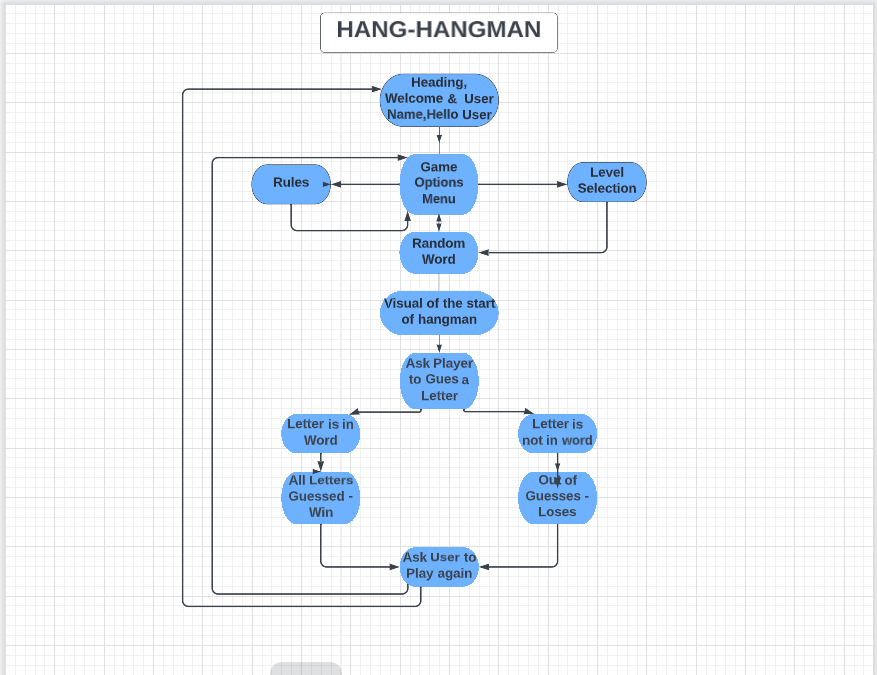

# HANG-HANGMAN

Hang-Hangman is a word guessing game .
The user will be given the game rules , a level choice to play the game at Easy , Medium or Hard.
The user can try to guess the word by inputting letters, if the letter is wrong a visual of the traditional hangman man will start to appear, if the letter is in the word the letter is shown and another guess can be made. Until either all lives are used or the game is won.
The aim is to supply a fun word guessing game to the user.

# Planning Of Hang-Hangman

* When Planning what I thought about and wanted in the game.

  + What I wanted the user to see and be able to do .
  + What I wanted the user not to be able to see but the program to do .
  + I wanted the game to be easy to use have easy to folow instructions with a logical flow to the  game.
  + I wanted the game to give feed back to the user if the instructions where not followed correctly or if incorrect information was input by accident.
  + I wanted the game to have a bit of color to it to give it a more fun look and to show with the colours instuctions , correct input and incorrect input.

* For the User

  + A nice Introduction
  + Easy to Follow Instructions
  + Clear information to make choices
  + Levels in the Game to keep it Interesting
  + Fun to Play  

# Flowchart

* The logical flow of how I was going to implement the coding of the game

  + Where to use inputs & check inputs.  
  + Where to give user feed back.
  + Where to give choices and direct of game from those choices.
  + Check the logic of the game lay out in order to code accordingly.
 

# Features

# Introduction and Welcome

# Game in Play

# Game Won

# Technologies  / Support Used

* Below is a list of Technologies / Support I have used to build my site.

    + Code Institute lessons and the Love Sandwiches in assisting with how to start and construct my project.
    + Code Institute Supplied the template inorder to display Python in a Visual formed Terminal
    + GitHub for my repository 
    + Git used to code within and provided backups of all my code.
    + Hourokapp for project deployment
    + Patorjik.com for the Game Logo https://patorjk.com/software/taag/#p=display&f=Letters&t=HANG%20-%0AHANGMAN
     
# Testing
* Testing During development of the project was done through out the project to see how the project looked and felt within the Git Terminal using python3. run.py

  * Manual Testing

| Feature           |  Expect              |  Action |  Result                 |
|-------------------|----------------------|---------|-------------------------|
|                   |                      |         |                         |
|                   |                      |         |                         |
|                   |                      |         |                         | 

* User Testing

    + Expectations
      As a user I wanted the site to 
      1. Understand the purpose of the site, 
      2. Be able to navigate easily through the site,
      3. 
      4. 
    + Result
      As a user I was able to  
      1. 
      2. 
      3. 
      4. 

# Bugs 

# Validator testing
  * PEP8 
    * No errors were returned from 

# Deployment of Project
  
# Credits
  