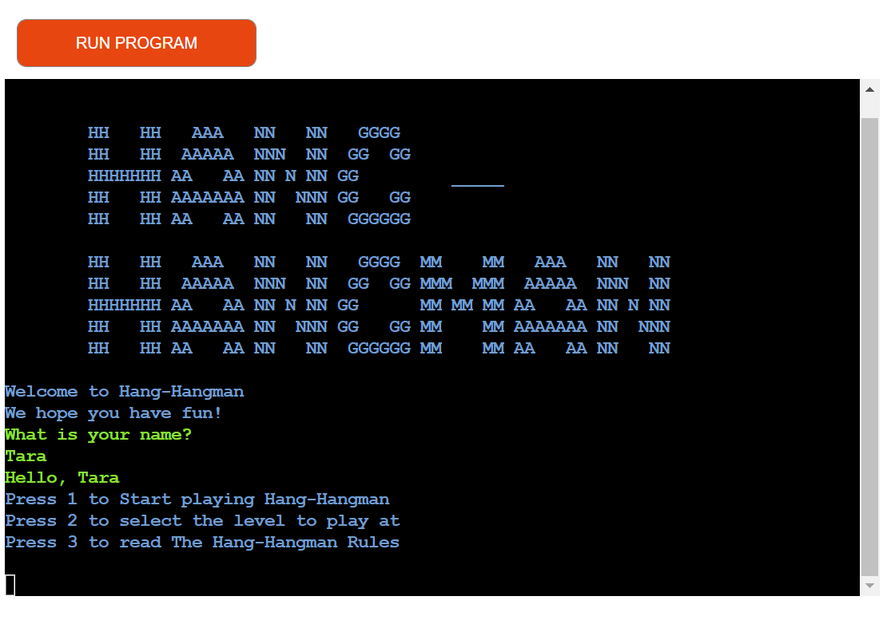
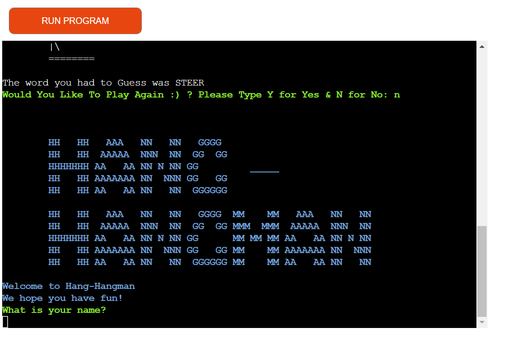

# HANG-HANGMAN

Hang-Hangman is a word guessing game .
The user will be given the game rules , a level choice to play the game at Easy , Medium or Hard.
The user can try to guess the word by inputting letters, if the letter is wrong a visual of the traditional hangman man will start to appear, if the letter is in the word the letter is shown and another guess can be made. Until either all lives are used or the game is won.
The aim is to supply a fun word guessing game to the user.

* Git Repository can be found here : https://github.com/TaraHelberg/Hang-Hangman

* Git Deployed site can be found here : https://hang-hangman.herokuapp.com/

# Planning Of Hang-Hangman

* When Planning what I thought about and wanted in the game.

  + The user to see and be able to do .
  + The user not to be able to see but the program to do .
  + The game to be easy to use have easy to folow instructions with a logical flow to the  game.
  + I wanted the game to give feed back to the user if the instructions where not followed correctly or if incorrect information was input by accident.
  + I wanted the game to have a bit of color to it to give it a more fun look and to show with the colours instuctions , correct input and incorrect input.

* For the User

  + A nice Introduction
  + Easy to Follow Instructions
  + Clear information to make choices
  + Levels in the Game to keep it Interesting
  + Fun to Play  

# Flowchart

* The logical flow of how I was going to implement the coding of the game

  + Where to use inputs & check inputs.  
  + Where to give user feed back.
  + Where to give choices and direct of game from those choices.
  + Check the logic of the game lay out in order to code accordingly.
 * Note : The flow chart was rough and for me to work from and does not show all the code but assisted me in how I needed to start to code and how the code should flow

# Features

  * Current Features

   * Terminal Pages in Order of game Flow

      + Heading Log
      + Welcome
      + User Name Request
      + Input Space shown

  

  * Note once the User Enters user name it triggers the option menu to be shown 

      + Users Name Entered
      + Hello "Users Name"
      + Options Menu shown
      + Input Space shown

   

  * Note on option selection it will trigger the selection to start 
    * Option 1 = Default Game Level to start   

      + 1 Input by user 
      + Game Deault level starts Lives shown
      + The word to Guess 
      + Guess a letter
      + Input Space Shown

   
  
  * Note on option selection it will trigger the selection Game Level option & clear the terminal screen
    * Option 2 = Game Level to options Seelction

      + 2 Input by user 
      + Screen clears & Game Level option shows .
      + Input Space Shown
      + Note on selection of any of the 3 options game will start at that level

  

* Note on option selection it will trigger the selection to Game Rules 
    * Option 3 = Game Rules   

      + 3 Input by user 
      + Game Rules shown below 
      + Pressing enter will return to the Options Menu on a cleared terminal
      
  

# Game in play

  * Note that on selction of either options 1 or any off the leves in Options 2 the Game will start .
      + Is letter in word check and result of letter not in word 
      + Is letter in word check and result of letter in word
      + Input of more than 1 letter check and result / just pressing enter 
      + Input of not a letter check and result 
      + Input of a letter already used and result
  * Note Hangman visuals begins to build on letter not in word as life is lost level drops
  * Note User is informed and directed during game play screen is cleared of messages as game progresses    

# Game Won & Game Lost

* Game Won
  + Won message 
  + Option to either play again Y / N will appear

* Game Lost
  + You Lose Message
  + Option to either play again Y/ N will appear

# Play again Y/N Choice

  * Yes option 
    + User Input Y 
    + Main Options Menu 
    + Input Space Shown

  * On selection of option screen will clear and run the selected option

  

 * No option 
    + User Input N 
    + Game Heading Logo ,Welcome & User name request  
    + Input Space Shown

  * Game is back at the beginning

  

* Prospective Features

  + Using Google sheets & Api - To keep and return game score Previous, Present hight scores etc. To stored by the name of the user. 
  + Addition of code to be able to guess entire word and once word was guessed return option of playagain Y/N 

  * Note :For the code itself I am sure with more work and further understanding of Pyhton code could be made to be neater and simpler with less repeated code . 

# Technologies  / Support Used

* Below is a list of Technologies / Support I have used to build my site.

    + Code Institute lessons and the Love Sandwiches in assisting with how to start and construct my project.
    + Code Institute Supplied the template inorder to display Python in a Terminal :https://github.com/Code-Institute-Org/python-essentials-template
    + GitHub for my repository 
    + Git used to code within and provided backups of all my code.
    + Hourokapp for project deployment https://dashboard.heroku.com/apps
    + Patorjik.com for the Game Logo https://patorjk.com/software/taag/#p=display&f=Letters&t=HANG%20-%0AHANGMAN
    + Lucidchart for my Flowchart which helped with the logic & flow of my code https://www.lucidchart.com/
    + Youtube tutorial to base my project around : https://www.youtube.com/watch?v=m4nEnsavl6w
    + Stackoverflow for codeing assitance when need and some code that I copied and refered to in docstrings.
    + 101 computing for the clear screen code : https://www.101computing.net/python-typing-text-effect/ 
    + Used to make my Heading Logo : http://patorjk.com/
    
# Testing
* Testing During development of the project was done through out the project to see how the project looked and felt within the Git Terminal using python3 run.py to assertain if the code was working and if any errors "Bugs" occured PEP8 was also used throught the project.

  * Manual Testing

| Feature            |  Expect                       | Action  | Result              |
| ------------------ | ----------------------------- | ------- | -------------------|
|  Heading Log       |  Display On Open              |  N/A    |   ✔                | 
|  Welcome           |  Display On Open              |  N/A    |   ✔                |
|  User Name Request |  Display On Open              |  N/A    |   ✔                |
|  User Input Name   |  User to Input Name []        | Enter   |   ✔ Name & Entered |
|  Hello {NAME} &    |  Displays On Enter -          | N/A     |   ✔                | 
|  Show Game Menu    |  of User Name & Enter         | N/A     |   ✔                | 
|  Option 1          |  Game to start                |1 & Enter|   ✔                |
|  Game Starts       |  Lives Displayed              | N/A     |   ✔                |
|  Game Starts       |  Hidden Word Displayed        | N/A     |   ✔                |
|  Game Starts       |  Gues a Letter & Input []     | N/A     |   ✔                |
|  Option 2          |  Level Menu Displayed         |2 & Enter|   ✔                |
|  Level Menu E      |  Game To Start                |E & Enter|   ✔                |
|  Game Starts       |  Lives Displayed              | N/A     |   ✔                |
|  Game Starts       |  Hidden Word Displayed        | N/A     |   ✔                |
|  Game Starts       |  Guess a Letter & Input []    | N/A     |   ✔                | 
|  Level Menu M      |  Game To Start                |M & Enter|   ✔                |
|  Game Starts       |  Lives Displayed              | N/A     |   ✔                |
|  Game Starts       |  Hidden Word Displayed        | N/A     |   ✔                |
|  Game Starts       |  Guess a Letter & Input []    | N/A     |   ✔                | 
|  Level Menu H      |  Game To Start                |H & Enter|   ✔                |
|  Game Starts       |  Lives Displayed              | N/A     |   ✔                |
|  Game Starts       |  Hidden Word Displayed        | N/A     |   ✔                |
|  Game Starts       |  Guess a Letter & Input []    | N/A     |   ✔                |  
|  Option 3          |  Game Rules Displayed         |3 & Enter|   ✔                |
|  Game Rules        |  Return to  Game Menu         | Enter   |   ✔                |
|  Guess a letter [] |  Input a letter of Choice     | Choice  |   ✔ & Enter        |
|  During Game Play  |  Hangman Visual to Build      | N/A     |   ✔                |
|  During Game Play  |  Letter Not in Word Message   | N/A     |   ✔                |
|  During Game Play  |  Letter In Word Message       | N/A     |   ✔                |
|  During Game Play  |  Not a letter or _ Message    | N/A     |   ✔                |
|  During Game Play  |  More than 1 letter Message   | N/A     |   ✔                |
|  Game Play Won     |  You Won & Play Again Message | N/A     |   ✔                |
|  Game Play Lost    |  You Lost & Play Again Message| N/A     |   ✔                |
|  Play Again Message|  Option to Select Y or No []  | Y / N   |   ✔ Y/N & Enter    |
|  Play Y Input      |  Returns to Main Menu         |Y & Enter|   ✔                |
|  Play N Input      |  Returns to Heading,Welcome   |N & Enter|   ✔                |

* User Testing

  * Expectations
     As a user I wanted the project to 
    1. A nice Introduction
    2. Easy to Follow Instructions
    3. Clear information to make choices
    4. Levels in the Game to keep it Interesting
    5. Fun to Play      

  * Result
     As a user I was able to  
    1. Be introduced to the Game & Welcome
    2. The instructions are clear and easy to follow 
    3. Information is clear and I could make choices in the game 
    4. The game provided levels of play so I could challenge myself and it kept me interested
    5. It was fun to play
      
# Bugs

Bugs and erros econountered during coding of project were solved through contiuned testing throught the development.
Using print statements and through git terminal python3 run.py.
Testing code to see what the code was doing and how it was responding as well as locating any errors that might be brought up in the problems part of git.
Code was also run through the PEP8 during development for the same reason.
* Bugs / Errors encountered
 + I did as new to python have many syntax errors as wells as indent errors and white space errors.
 + Breaks in my while loop was detected this way & resolved 
 + another error detected and resolved was the open encoding for my random word 

* Unfixed Bugs / Erros 
 + I feel that a bug although the code works are the repeated code which I feel could be simplified into either 1 line or into a def () function to be used as 1 line of code
 + Also although it does not effect the game a bug I feel is that you can not guess the entire word and would like to reslove this .

# Validator testing
  * PEP8 
    * Both .py files tested

  run.py no errors returned

  constants.py no errors returned

  * Lighhouse Testing
  I ran Google Lighthouse 

       

# Deployment of Project

  * Deployment was made possible by GitHub
    + Initiated a repository in git via template supplied by codeinstute : :https://github.com/Code-Institute-Org/python-essentials-template
    + Click Use this Template
    + Add repository name
    + Click Create Repository from template 
    + Created all folders and files and code project
    + Insure all inputs and any other location required have the \n required for Heroku
    + In terminal type pip3 freeze > requirements.txt press enter , file is updated
    + Remembering to add , commit and push all changes to github
    + Go to https://dashboard.heroku.com/apps
    + Click New
    + Select Create New app
    + Add project name & Changed Region to relevant country
    + Click create app
    + Go to settings section click on 
    + Check config var and added PORT & 800 as I did not have any confidential files this was all that was needed
    + Got to Build Packs 
    + Add python click save
    + Add Nodejs click save
    + Check the order of these two files
    + Go to Deploy Section 
    + Go to Deployment Method
    + Select GItHub
    + Click connect to GitHub
    + Put the repository name of Project in & click search
    + Click connect
    + Scroll down and choose Automatic deploys so as to insure project updates done in github are updated as code is changed or added to project
    + Click enable automatic deploys
    + Once project deployment has been completed a message will be shown and a button will be shown to view the mock terminal .
    + Click "View" button to be taken to mock terminal

# Clone Project 

* Cloning of Project was made possible by GitHub
    + Go to Git Hub
    + Go to Hang-Hangman repository https://github.com/TaraHelberg/Hang-Hangman
    + Click on it to go to main repository site 
    + Click on the Code drop down button menu next to the greeen Gippod button
    + Click on HTTP section you will see the http of the repository click on the window next to it it will say copied
    + Clikced on Download and Zip
    + Clicked on Open with GitHubDesktop
      
# Credits

   * Code Institute without who I would have had no base to begin a project & Readme.md Template or the special terminal for python .https://codeinstitute.net/ie/
   * Reuben Ferrante my mentor without all his great guidance I would be lost. A Huge Thanks. https://github.com/arex18
   * Youtube video tutorial to base my game on. https://www.youtube.com/watch?v=m4nEnsavl6w
   * The Slack community - for someone always been there no matter the time and with advice or direction. https://slack.com
   * StackOverflow for all the information to assit with my project . https://stackoverflow.com
     These two links in particular :
     https://stackoverflow.com/questions/40835800/getting-a-random-word-from-a-text-file
     https://stackoverflow.com/questions/9896508/python-encoding-decoding-for-writing-to-a-text-file 
   * I am Responsive for a visual of the project on devices. https://ui.dev/amiresponsive?msclkid=400b1adabe5b11ecbc48938198bb87b4
   * 101 computing for the clear screen code : https://www.101computing.net/python-typing-text-effect/ 
   * Used to make my Heading Logo : http://patorjk.com/

  